<h1> Hoevery Project </h1>

 <b>Application</b> <i><b>สำหรับเช่าเครื่องจักรประเภทของรถขุด</b></i> แอพพลิเคชั่นให้บริการเช่า<b>รถขุดเจาะ</b> โดยนํารถขุดเจาะเข้ามา
ใช้ร่วมกับ IoT เพื่อเพิ่มความสะดวกสบายให้แก่ผู้ใช้บริการ เนื่องมาจากผู้ใช้บริการไม่ว่าจะเป็นผู้รับเหมา
ก่อสร้างหรือเกษตรกรที่ต้องการ<b>รถขุดเจาะ</b>จะต้องติดต่อกับผู้ให้เช่าโดยตรง โดยส่วนใหญ่จะได้การแนะนำ
มาจากร้านวัสดุก่อสร้างบริเวณใกล้เคียงกับสถานที่ที่จะต้องใช้งานหรือค้นหาข้อมูลการติดต่อมาจาก internet 
เราจะเห็นได้ว่ากระบวนการการเช่า<b>รถขุดเจาะ</b>ข้างต้นนั้นมีความยุ่งยาก เพราะจะต้องติดต่อกับผู้ให้เช่าหลาย
แห่งเพื่อทำการเปรียบเทียบราคาและข้อกำหนดต่างๆ จึงทำให้เราเกิดแนวคิดในการพัฒนาแอพพลิเคชั่นการ
เช่า<b>รถขุดเจาะ</b>ที่มีความครอบคลุมหลายๆ ด้าน เช่น ผู้เช่าสามารถเห็นลักษณะของรถขุดเพื่อดูความเหมาะสม
กับงานที่ต้องการใช้งาน ผู้เช่าสามารถรู้ตำแหน่งของรถขุดที่จะเช่าได้ว่าอยู่สถานที่ไหนที่ใกล้มากที่สุดเพื่อลดค่า
ใช้จ่ายในการขนส่งและระหว่างการเช่าผู้เช่าก็สามารถตรวจสอบหรือติดตามสถานะการทำงานของรถได้อีกด้วย.

 <h2> Application </h2>
ตัวอย่าง Application
<ul>
<b>แสดงรายการรถขุดที่อยู่ใกล้</b> 
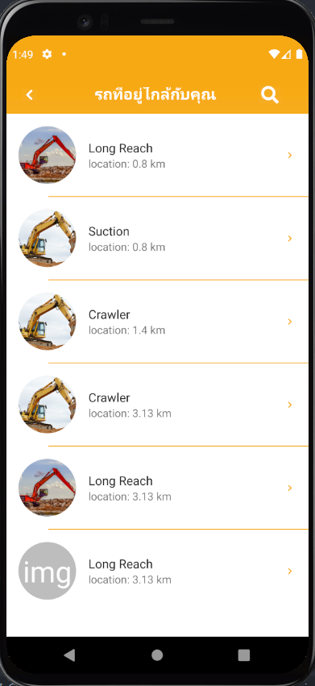  
<b>รายละเอียดของรถที่ให้เช่า</b> 
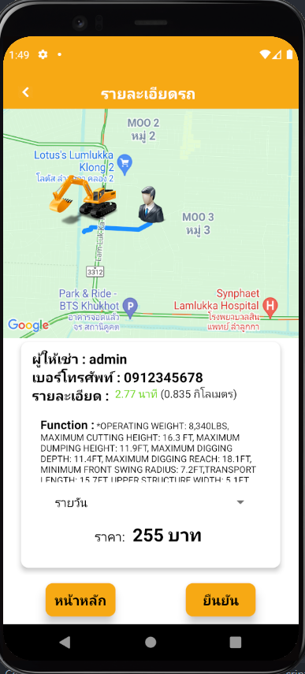 
</ul>

 <h2> Hardware </h2>
<h3>กล่องใส่อุปกรณ์</h3>
<ul>
<b>กล่องใส่อุปกรณ์ GPS Module</b> 
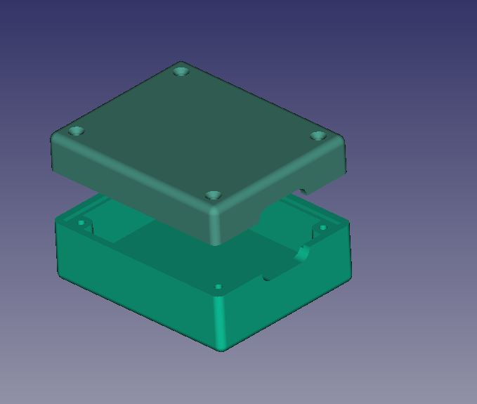 
<b>กล่องใส่อุปกรณ์ esp32</b> 
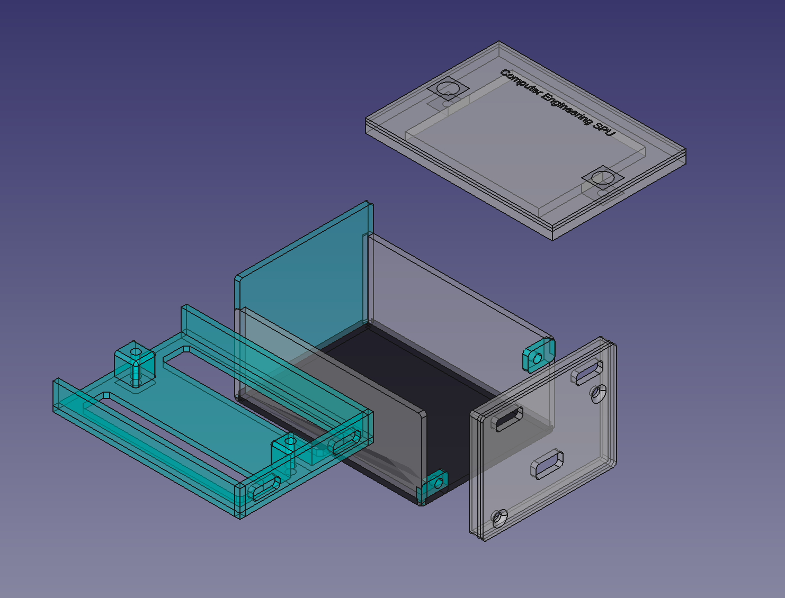
</ul>

<ul>
<b>Sender</b>  
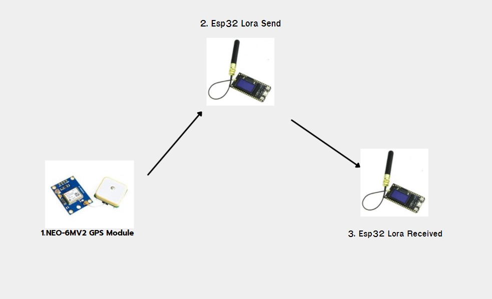
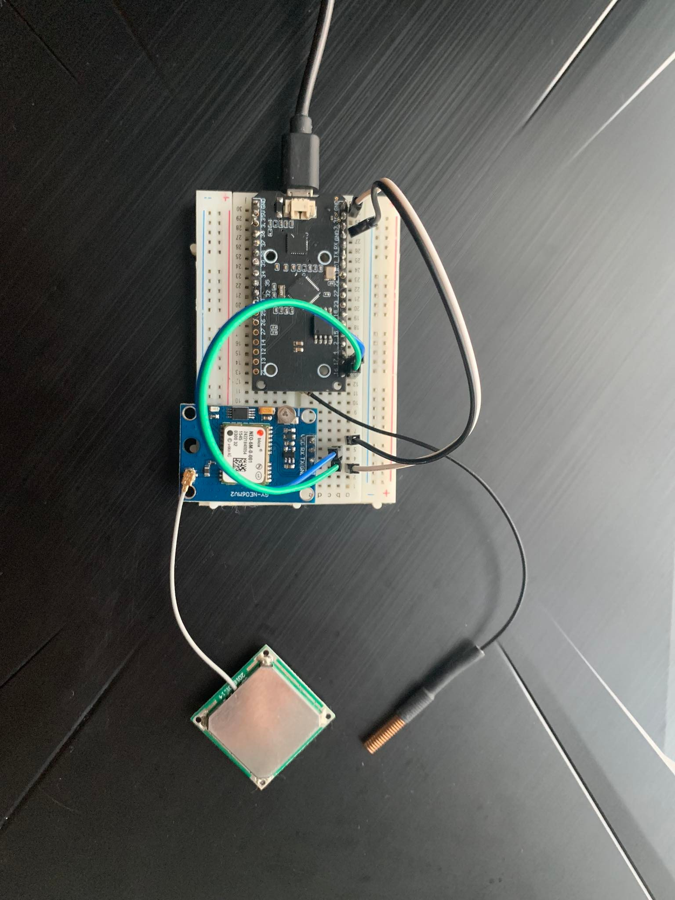 
<b>Receive</b>  
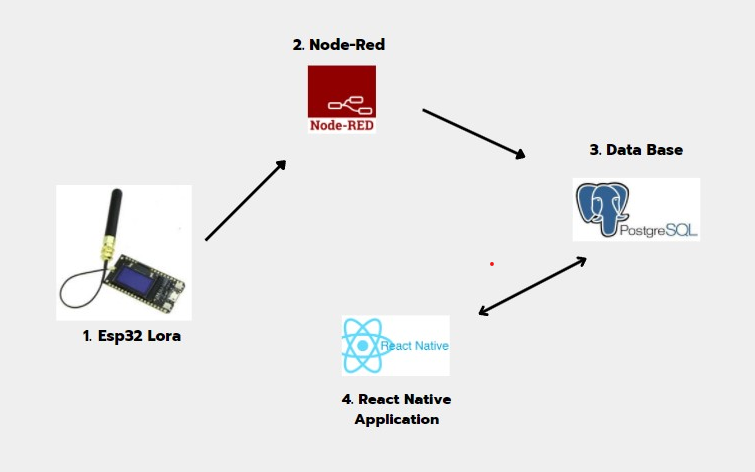
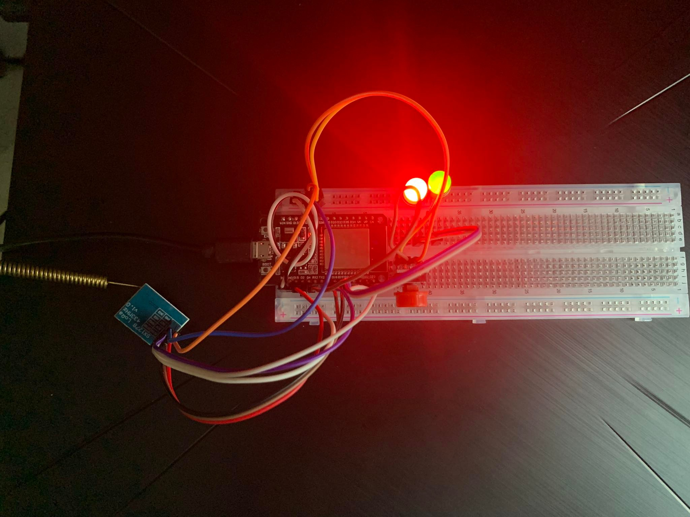 
</ul>

<h2>Database (PostgreSQL)</h2>
<b>ER Diagram</b>  
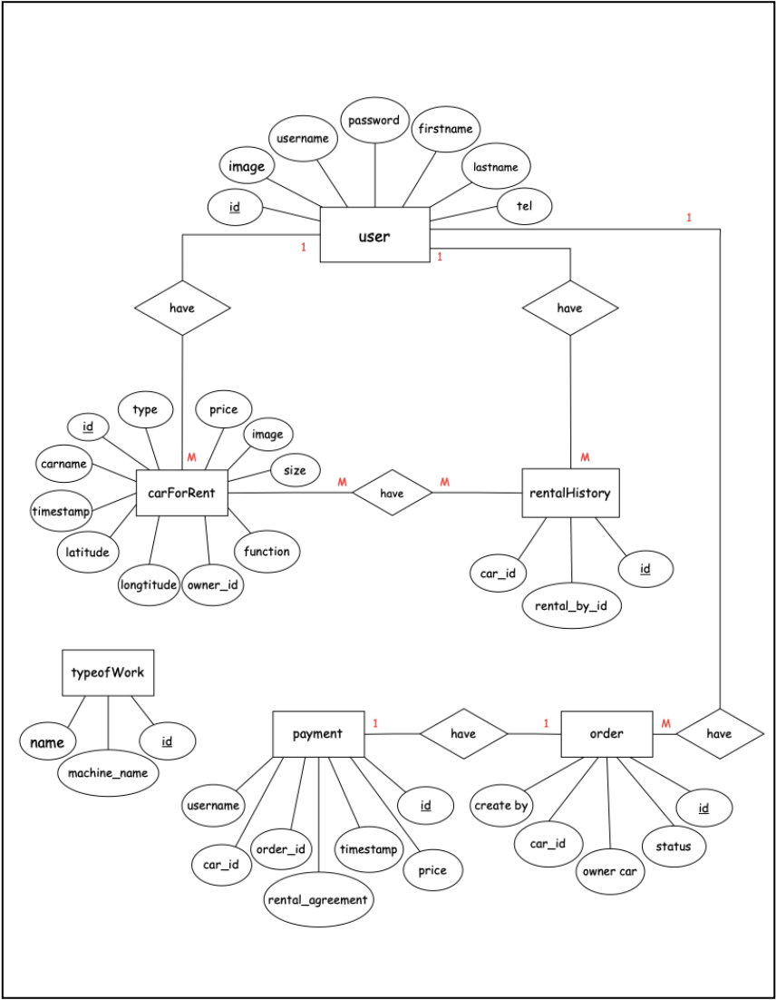 
<b>Database Table</b>  
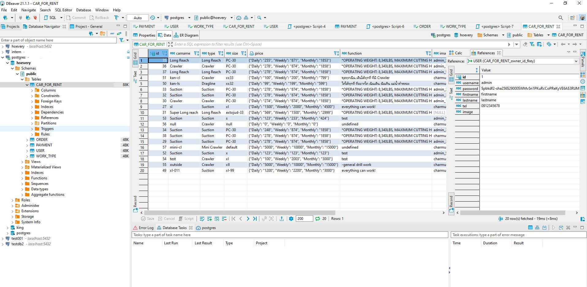 

<h2>API Framework (FastAPI)</h2>
<b>API Example</b>  
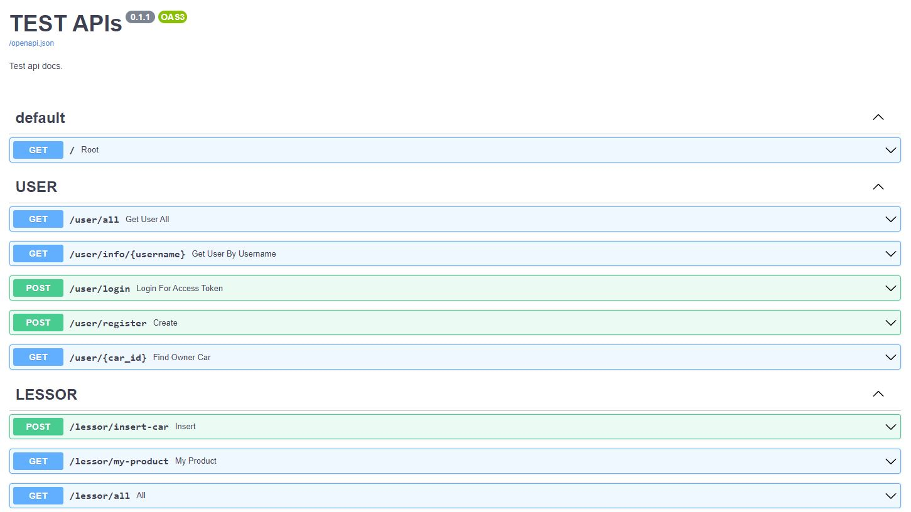 

         - - - - - - - - - - - - - - - - - - - - - - - - - - - -
        | COMPUTER ENGINEERING 61  | SRIPATUM UVIVERSITY        |
         - - - - - - - - - - - - - - - - - - - - - - - - - - - -
        | CPE405(T), CPE405(L), ICT493(T),CPE451(T)             |
         - - - - - - - - - - - - - - - - - - - - - - - - - - - -
        | Aumpu simanon            |       61033125             |
        | Bussayamas Precharburana |       610                  |
        | Panupong Aerbaim         |       610                  |
        | Parkin Thanantthanachon  |       61043845             |
         - - - - - - - - - - - - - - - - - - - - - - - - - - - -
