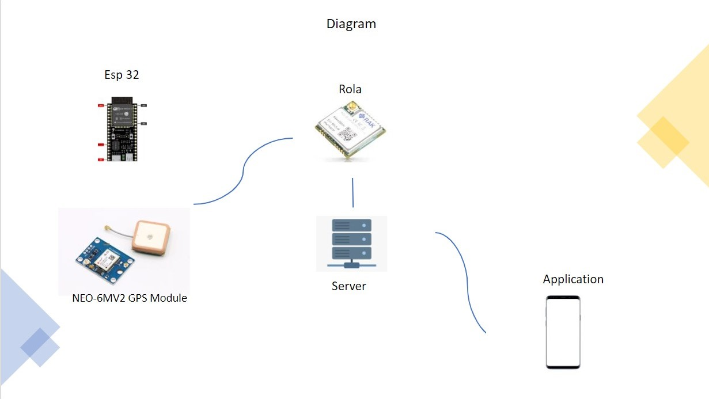

<h1> Hoevery</h1>
<h2>ตัวอย่างการสร้างกล่องใส่อุปกรณ์</h2>

กล่องใส่อุปกรณ์ GPS Module

<<<<<<< HEAD

กล่องใส่อุปกรณ์ esp32

=======

กล่องใส่อุปกรณ์ esp32

>>>>>>> 8da9bc611c0fb3597d7e8b8a535d9944c9e9e4e3

<h1> Hardware </h1>
<h2>Diagram</h2>

